Crop Analysis Q3 2013
================
John Smith
May 3rd, 2014

``` r
# Class 05 R graphics intro

# My first boxplot
x <- rnorm(1000,0)
boxplot(x)  
```

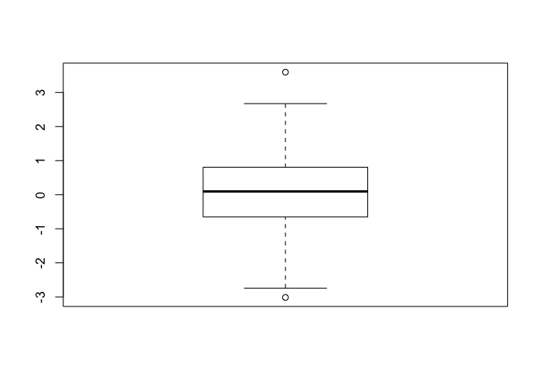

``` r
summary(x)
```

    ##     Min.  1st Qu.   Median     Mean  3rd Qu.     Max. 
    ## -3.01564 -0.65079  0.09497  0.06541  0.80616  3.59646

``` r
hist(x)
```

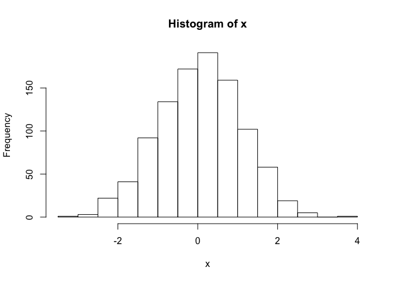

``` r
boxplot(x,horizontal = TRUE)
```

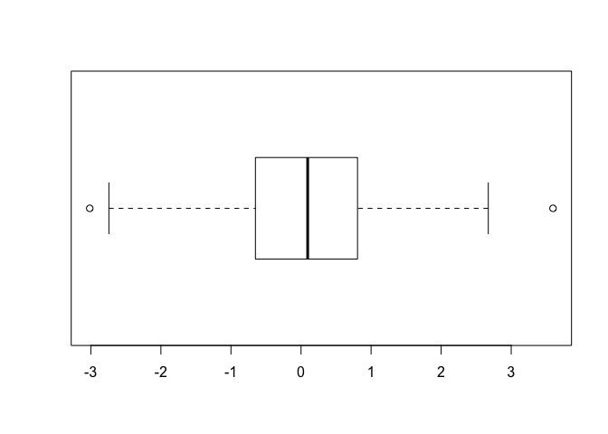

``` r
# Hands on session 2 
weight <- read.table("bimm143_05_rstats/weight_chart.txt",header = TRUE)
plot(weight,pch=15,cex=1.5,lwd=2,ylim=c(2,10), xlab="age (months)",ylab="weight (kg)", main="some title")
```

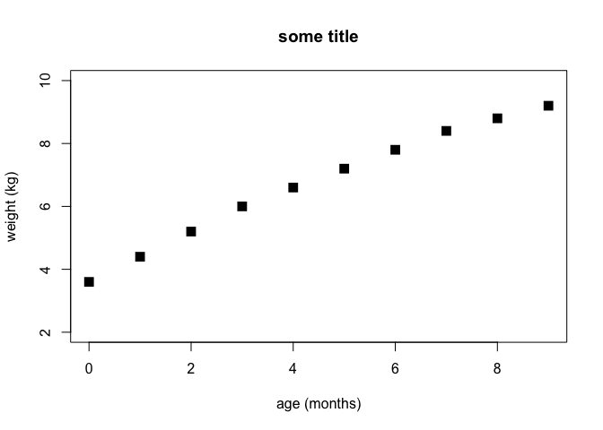

``` r
plot(weight$Age, weight$Weight, typ="o", pch=15, cex=1:4, col="red", lwd=3, ylim=c(2,10), xlab="age(months)",ylab="weight(kg)", main= "Baby weight with Age")
```

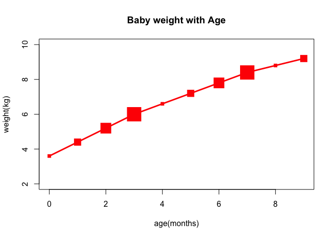

``` r
#Try a barplot
barplot(VADeaths, beside = TRUE)
```


``` r
barplot(VADeaths,beside=FALSE)
```


``` r
 ## Input our eature count data
mouse <- read.table("bimm143_05_rstats/feature_counts.txt", header = TRUE, sep= "\t")
barplot(mouse$Count,horiz= TRUE, names.arg= mouse$Feature, las=2)

# change margin so we can see the labels
par(mar=c(5.1, 11.1, 4.1, 2.1))
barplot(mouse$Count, horiz=TRUE, names.arg= mouse$Feature, las=2)
```

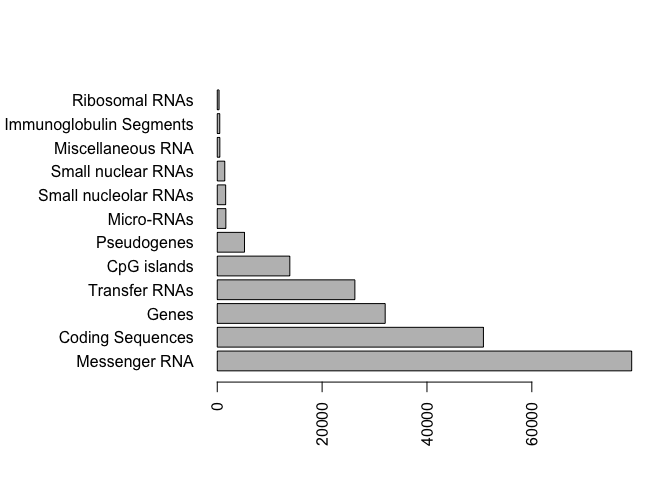

``` r
#add some color
barplot(mouse$Count, horiz=TRUE, names.arg = mouse$Feature, las=2, col=rainbow(11))
```

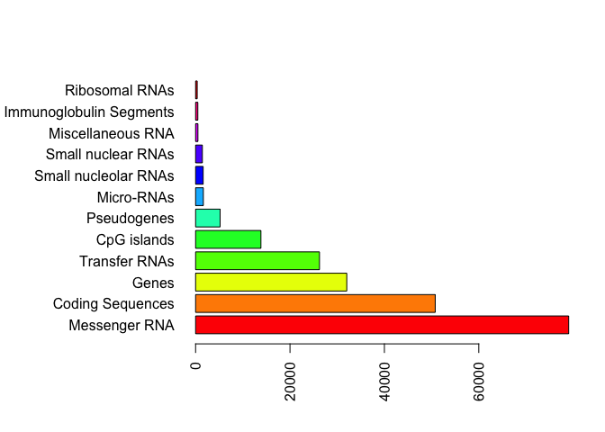

``` r
par(mar=c(3.1, 11.1, 4.1,2))
barplot(mouse$Count, names.arg=mouse$Feature, horiz=TRUE, ylab="", main="Number of features in the mouse GRcm38 genome", las=1, xlim=c(0,80000))
```

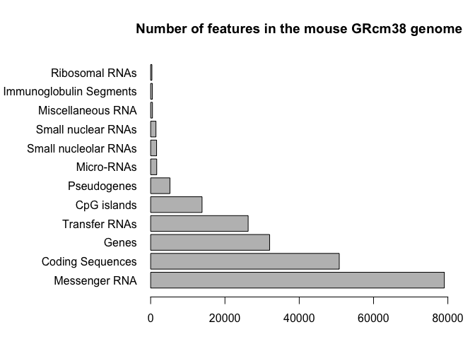

``` r
#section 3: Using color in plots
mf<-read.delim("bimm143_05_rstats/male_female_counts.txt")
barplot(mf$Count, names.arg = mf$Sample, col = rainbow(nrow(mf)), las=2, ylab = "Counts")
```

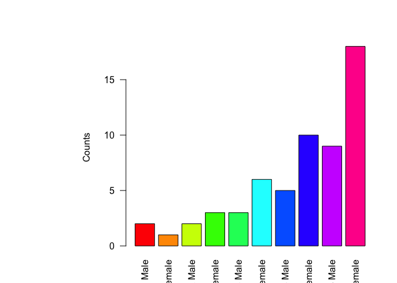

``` r
barplot(mf$Count, names.arg = mf$Sample, col=c("blue2", "red2"), las=2, ylab = "Counts")
```

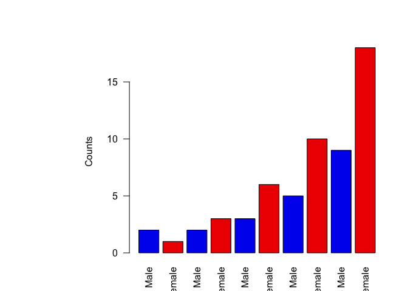

``` r
#coloring by value
genes <- read.delim("bimm143_05_rstats/up_down_expression.txt")

# Expresion data

e<- read.table("bimm143_05_rstats/up_down_expression.txt", header = TRUE)

# how many genes
nrow(e)
```

    ## [1] 5196

``` r
# How many up, down and all around?
#table(e$state)

plot(e$Condition1, e$Condition2, col=e$State)
```

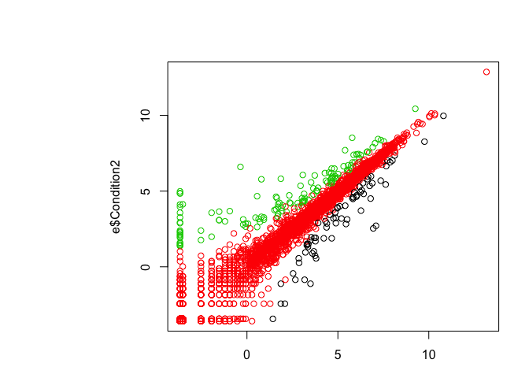

``` r
# Play
palette(c("red","green","blue"))
plot(e$Condition1, e$Condition2, col=5)
```

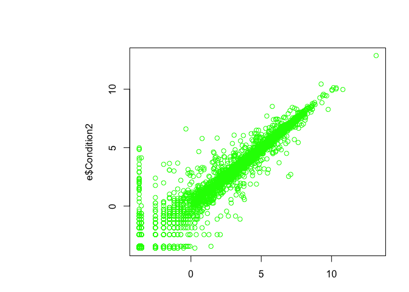

``` r
boxplot(x,horizontal = TRUE)
```

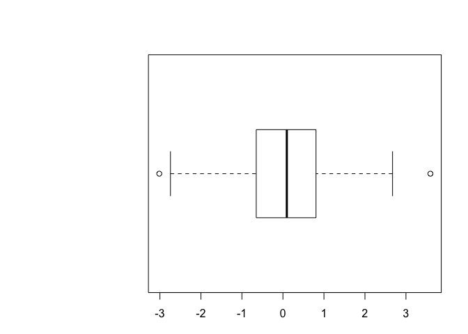

``` r
#?read.table
# Hands on session 2 
weight <- read.table("bimm143_05_rstats/weight_chart.txt",header = TRUE)
#View(weight)
plot(weight,pch=15,cex=1.5,lwd=2,ylim=c(2,10), xlab="age (months)",ylab="weight (kg)", main="some title")
```

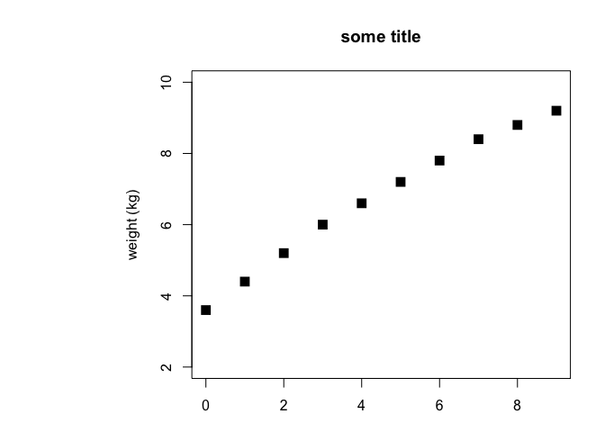
